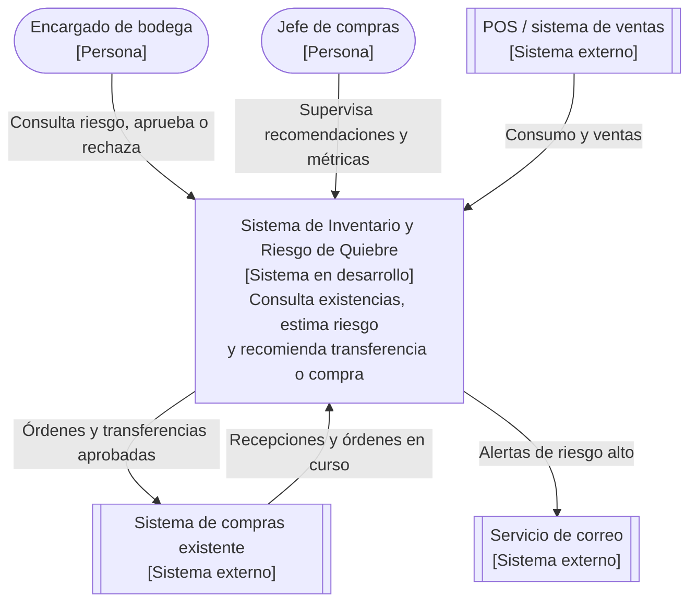
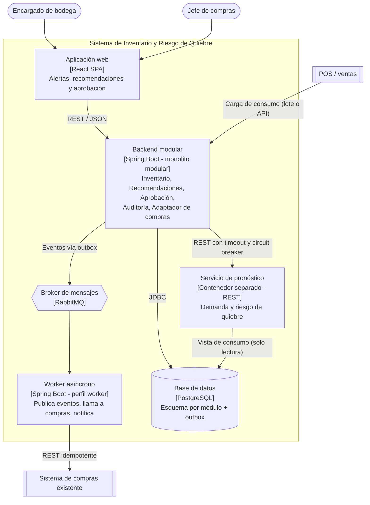
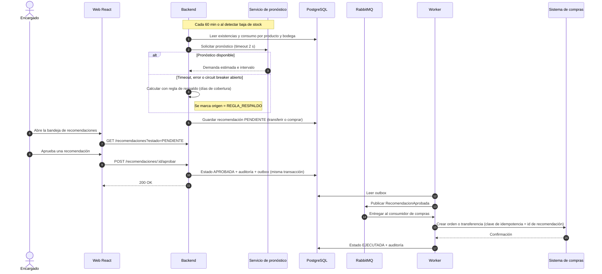

# Ejercicio 1 — Inventario y riesgo de quiebre

> **Diseño de Sistemas** · Taller de arquitectura · Ejercicio 1 de 4

| | |
|---|---|
| **Autor** | TU NOMBRE AQUÍ |
| **Curso** | Diseño de Sistemas |
| **Diagramas** | Mermaid (se visualizan directamente en GitHub) |

## Contenido

- [Decisiones clave del enunciado](#decisiones-clave-del-enunciado)
- [1. Objetivo, actores y alcance](#1-objetivo-actores-y-alcance)
- [2. Requisitos funcionales y de calidad](#2-requisitos-funcionales-y-de-calidad)
- [3. Diagramas C4](#3-diagramas-c4)
- [4. Flujo de una operación crítica: generar y aprobar una recomendación](#4-flujo-de-una-operación-crítica-generar-y-aprobar-una-recomendación)
- [5. Stack propuesto y justificación](#5-stack-propuesto-y-justificación)
- [6. Dos ADR](#6-dos-adr)
- [7. Tres riesgos y cómo reducirlos](#7-tres-riesgos-y-cómo-reducirlos)
- [8. Métricas](#8-métricas)
- [Estructura del repositorio](#estructura-del-repositorio)
- [Verificación de cumplimiento](#verificación-de-cumplimiento)

## Decisiones clave del enunciado

| Pregunta | Decisión | Justificación |
|---|---|---|
| ¿Monolito modular o microservicios? | **Monolito modular** (Spring Boot) y el **servicio de pronóstico como contenedor aparte** | Un solo dominio, un solo equipo y volumen transaccional bajo: microservicios sumarían despliegues, red y consistencia distribuida sin beneficio. El pronóstico sí se separa porque cambia a otro ritmo, consume más cómputo y es la pieza que puede fallar. |
| ¿Qué módulos? | **Inventario, Pronóstico (cliente), Recomendaciones, Aprobación, Auditoría** y un **Adaptador de compras** | Cada módulo es un paquete con interfaz interna explícita; ninguno lee tablas de otro. Se verifica con pruebas de arquitectura. |
| ¿Cómo se integra con compras? | **Capa anticorrupción**: un adaptador traduce la recomendación aprobada al formato del sistema de compras y la ejecuta mediante un worker con llamada REST idempotente | El dominio no depende del modelo de compras. Si compras cae, la orden queda en cola y se reintenta sin duplicarse. |
| ¿API o evento? | **Ambos, cada uno donde corresponde**: API REST para consultar y aprobar (síncrono, lo inicia una persona); evento `RecomendacionAprobada` para ejecutar y notificar (asíncrono) | La consulta necesita respuesta inmediata; la ejecución en compras no debe bloquear al encargado ni perderse si compras está caído. |
| ¿Y si el pronóstico no está disponible? | **Degradación controlada**: timeout de 2 s + circuit breaker; se calcula con una **regla de respaldo** (días de cobertura = existencias ÷ consumo medio de 14 días) y la recomendación se marca `REGLA_RESPALDO`. Sigue requiriendo aprobación | Consultar existencias nunca depende del pronóstico. El encargado ve que la estimación es menos fina y decide con esa información. |

## 1. Objetivo, actores y alcance

**Objetivo.** Anticipar quiebres de stock en las bodegas de la cadena y recomendar una **transferencia entre bodegas** o una **compra**, con aprobación humana previa, para reducir las compras urgentes.

**Actores.**
- **Encargado de bodega:** consulta existencias, aprueba o rechaza recomendaciones, registra conteos físicos.
- **Jefe de compras:** supervisa recomendaciones y métricas; aprueba compras sobre un monto definido.
- **Sistema de compras existente** (externo): recibe órdenes y transferencias, informa recepciones.
- **POS / ventas** (externo): fuente de consumo por producto.
- **Administrador/Auditor:** gestiona umbrales, usuarios y revisa la bitácora.

**Alcance.**
- *Dentro:* consulta de existencias, estimación de riesgo, recomendaciones, bandeja de aprobación, ejecución en compras, auditoría y métricas.
- *Fuera:* logística física del traslado, gestión de proveedores y precios, costeo de recetas.

**Supuestos.** El POS exporta consumo (por lote o API) y compras expone una API o, en su defecto, una tabla/archivo de intercambio. Hay decenas de bodegas y miles de productos, no millones.

## 2. Requisitos funcionales y de calidad

**Funcionales**
- RF1. Consultar existencias por producto y bodega, con fecha de última actualización.
- RF2. Registrar movimientos: recepción, consumo, merma, transferencia y conteo físico.
- RF3. Estimar días de cobertura y probabilidad de quiebre a 7 días por producto y bodega.
- RF4. Generar recomendaciones: transferir desde una bodega con excedente o comprar (cantidad, urgencia).
- RF5. Bandeja de aprobación: aprobar, rechazar con motivo o ajustar cantidad. **Nada se ejecuta sin aprobación.**
- RF6. Ejecutar la recomendación aprobada en compras y registrar su estado (ejecutada, fallida, reintentando).
- RF7. Alertar al encargado cuando el riesgo supere un umbral configurable.
- RF8. Auditar cada decisión y cambio de estado.

**Calidad**
- **Rendimiento:** consulta de existencias p95 < 500 ms; recálculo completo de riesgo cada ≤ 60 min.
- **Disponibilidad:** 99,5 % en horario operativo; con pronóstico o compras caídos, el sistema sigue mostrando existencias.
- **Resiliencia:** degradación con regla de respaldo; reintentos idempotentes hacia compras.
- **Trazabilidad:** bitácora de solo inserción, retención ≥ 2 años (configurable).
- **Seguridad:** autenticación OIDC/JWT y permisos por bodega.
- **Mantenibilidad:** límites entre módulos verificados automáticamente (Spring Modulith / ArchUnit).
- **Observabilidad:** logs con identificador de correlación, métricas y alertas.

## 3. Diagramas C4

### 3.1 Nivel 1 — Contexto



### 3.2 Nivel 2 — Contenedores



**Módulos dentro del backend:** *Inventario* (existencias y movimientos) · *Pronóstico* (cliente del servicio, con respaldo) · *Recomendaciones* (decide transferir o comprar) · *Aprobación* (máquina de estados `PENDIENTE → APROBADA/RECHAZADA → EJECUTADA/FALLIDA`) · *Auditoría* (bitácora) · *Adaptador de compras* (anticorrupción).

## 4. Flujo de una operación crítica: generar y aprobar una recomendación



**Garantías clave:** la aprobación y su evento se guardan en **una sola transacción** (patrón *outbox*), así que no puede aprobarse sin publicarse ni publicarse sin aprobarse. Si compras falla, el worker reintenta con *backoff*; tras N intentos la recomendación pasa a `FALLIDA` y se alerta.

## 5. Stack propuesto y justificación

| Capa | Elección | Por qué |
|---|---|---|
| Backend | Spring Boot (Java 21) + Spring Modulith + Resilience4j | Monolito con módulos verificables; timeouts y circuit breaker listos para el pronóstico. |
| Base de datos | PostgreSQL | Transacciones ACID para aprobación + outbox; esquema por módulo; bitácora de solo inserción. |
| Frontend | React | Bandeja de recomendaciones con filtros y aprobación en lote. |
| Comunicación | REST + OpenAPI | Contrato claro para web, POS y pronóstico. |
| Mensajería | **RabbitMQ** | Justificada: hay un proceso asíncrono (ejecución en compras) y una integración externa que debe reintentarse sin bloquear. Colas, ack y dead-letter resuelven esto sin la complejidad de Kafka. |
| Despliegue | Docker / docker-compose | Mismo entorno en desarrollo y pruebas. |
| Caché | **Redis: no se incluye** | No hay medición que lo justifique: las consultas van por índice. Se reevalúa si el p95 de consulta supera 500 ms con carga real. |
| Pronóstico (v1) | Servicio con media móvil / suavizado exponencial | Suficiente para empezar; se sustituye por un modelo mejor sin tocar el backend gracias al contrato REST. |

## 6. Dos ADR

Cada ADR también está como archivo individual en [`docs/adr/`](docs/adr/).

**ADR-001 — Monolito modular con el pronóstico como servicio separado** · Estado: Aceptada · Tipo: arquitectónica
- **Contexto:** un equipo pequeño, un dominio cohesivo y un componente (pronóstico) con ritmo de cambio y consumo de cómputo distintos que además puede fallar.
- **Decisión:** un backend monolítico modular (Inventario, Recomendaciones, Aprobación, Auditoría, Adaptador de compras) y el pronóstico como contenedor independiente consumido por REST con timeout y circuit breaker.
- **Alternativas:** microservicios completos (rechazado: complejidad operativa y consistencia distribuida sin necesidad); monolito con pronóstico embebido (rechazado: un fallo o pico de cómputo afectaría la consulta de existencias).
- **Consecuencias:** (+) despliegue simple, transacciones locales, pronóstico reemplazable. (−) hay que hacer cumplir los límites de módulo con pruebas; el pronóstico exige manejo explícito de fallos.

**ADR-002 — RabbitMQ con patrón outbox para integrar con compras** · Estado: Aceptada · Tipo: tecnológica
- **Contexto:** la ejecución en compras no debe bloquear la aprobación ni perderse o duplicarse si compras falla.
- **Decisión:** al aprobar, se guarda el evento en una tabla *outbox* en la misma transacción; un worker lo publica en RabbitMQ y otro consumidor llama al sistema de compras con una clave de idempotencia.
- **Alternativas:** llamada síncrona a compras al aprobar (rechazada: acopla disponibilidad); Kafka (rechazada: sobredimensionada para este volumen, sin necesidad de reproducción de historial); Redis (no se adopta, no hay necesidad demostrada).
- **Consecuencias:** (+) entrega al menos una vez sin duplicar efectos, desacople temporal. (−) un componente más que operar y consistencia eventual en el estado `EJECUTADA`.

## 7. Tres riesgos y cómo reducirlos

| Riesgo | Impacto | Mitigación |
|---|---|---|
| **Existencias inexactas** (mermas no registradas, conteos tardíos) generan recomendaciones erróneas | Alto | Conteos cíclicos, mostrar la antigüedad del dato en cada recomendación, ajustes de inventario con motivo y auditoría, tolerancia configurable. |
| **Integración con compras**: caída o duplicación de órdenes | Alto | Clave de idempotencia, outbox, reintentos con *backoff*, dead-letter y estado visible `FALLIDA` con alerta; modo manual documentado. |
| **Fatiga de aprobación**: demasiadas alertas, el encargado deja de revisarlas y el tiempo de aprobación crece | Medio | Priorizar por riesgo, agrupar por proveedor/bodega, aprobación en lote, caducidad de recomendaciones obsoletas y escalamiento al jefe de compras. |

## 8. Métricas

| Métrica | Tipo | Definición | Meta inicial | Fuente |
|---|---|---|---|---|
| **Quiebres por producto** | **Negocio (principal)** | Eventos con existencias = 0 por producto y semana | −50 % a los 3 meses | Movimientos de inventario |
| Compras urgentes | Negocio | Órdenes marcadas urgentes ÷ órdenes totales | −40 % | Sistema de compras |
| Recomendaciones aceptadas | Negocio | Aprobadas ÷ generadas | ≥ 70 % | Módulo de aprobación |
| Tiempo de aprobación | Negocio / proceso | Mediana entre `PENDIENTE` y decisión | < 4 h | Auditoría |
| **Disponibilidad del pronóstico y uso del respaldo** | **Técnica (principal)** | % de ciclos con `REGLA_RESPALDO` y p95 de latencia del pronóstico | respaldo < 5 %, p95 < 1 s | Métricas del circuit breaker |

## Estructura del repositorio

```text
diseno-sistemas-ej1-inventario-quiebre/
├── README.md                      <- documento completo del ejercicio
└── docs/
    ├── adr/
    │   ├── adr-001-monolito-modular-con-pronostico-separado.md
    │   └── adr-002-rabbitmq-con-outbox-para-compras.md
    └── diagrams/
        ├── c4-nivel1-contexto.mmd
        ├── c4-nivel2-contenedores.mmd
        └── flujo-generar-y-aprobar-recomendacion.mmd
```

Los archivos `.mmd` contienen el código fuente de cada diagrama; se pueden abrir y editar en <https://mermaid.live>.

## Verificación de cumplimiento

| Entregable solicitado | Dónde está |
|---|---|
| Objetivo, actores y alcance | §1 |
| Requisitos funcionales y de calidad | §2 |
| Diagrama C4 de contexto y contenedores | §3.1 y §3.2 (fuentes en `docs/diagrams/`) |
| Flujo de una operación crítica | §4 |
| Stack propuesto con justificación | §5 |
| Dos ADR (una arquitectónica y una tecnológica) | §6 y `docs/adr/` |
| Tres riesgos y cómo reducirlos | §7 |
| Una métrica de negocio y una técnica | §8 (marcadas como «principal») |
| Decisiones que debes tomar | Tabla «Decisiones clave del enunciado» |
